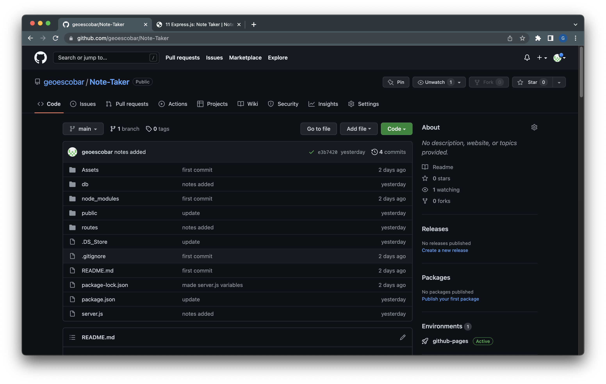
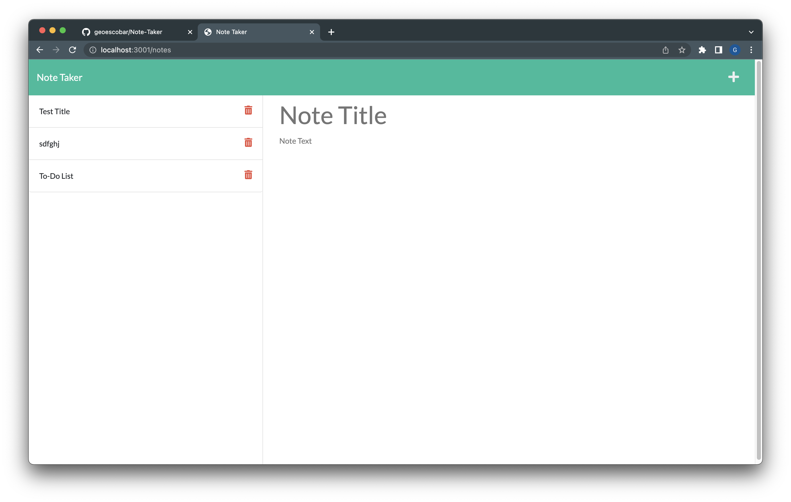

# Note Taker 

  An application that can write, save & delete notes. It will use Express.js back end and will save & retrieve the data from a JSON file. 
  ---
  ## License

  

  ---
## Table of Contents:

- [License](#license)
- [Description](#description)
- [Links](#links)
- [Installation](#installation)
- [Questions](#questions)

  ---
  ## Description

  #### Language/Frameworks Used
  
  	* node
	* html
	* css
	* javascript
	* npm
  * express.js

  
  #### Why did you build this project?
  
  * To demonstrate the skills learned using Express.js and to create an application that has real world use. 
  
  #### What problem does it solve?
  
  * It creates an easy place to have and store notes that can be saved and referenced for later. They can also be deleted when no longer needed. 
  
  #### What challenges did you face?
  
  * Understanding how to start and what files are needed to begin was a challenge. Also understanding pathways was a big challenge as it's extremely important to make sure I have those correct. 
  
  #### What did you learn?
  
  * I learned how to apply express.js to work with front end elements as well as understanding routes and their purpose. 
  
  ---
  ## Links 
  
  #### [Github Repo](https://github.com/geoescobar/Note-Taker)

  

  #### [Github Pages](https://geoescobar.github.io/Note-Taker/)
  

  ---

  ## Installation
  * The application should be functional and running and you can access it through the local host or through the GitHub pages link. 

  ---
  ## Questions 

  #### If you have questions regarding this repository? Below is my contact info:

  * github.com/geoescobar
  * geo.escobar214@gmail.com

